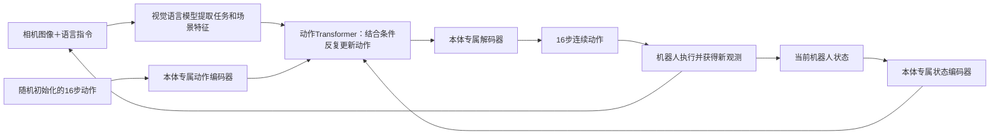

这篇论文是 NVIDIA 的 **《GR00T N1：面向通用人形机器人的开放基础模型》**。以下依据你提供链接对应的 **arXiv v2 正文及附录**，并核对了方法图、公式和实验表。gr00t_n1.pdf

先回应截图中的关注点：**GR00T N1 很适合用来理解 VLA 内部的模型协作。它的核心是视觉语言模型与动作生成模型的协同；论文也包含双机器人协作实验，但没有提出专门的多智能体通信或协商算法。**这两个层面需要分开理解。

**0．摘要原文翻译**

通用机器人需要一个功能多样的身体和一个智能的头脑。人形机器人近期取得的进展表明，它们有望成为在人类世界中实现通用自主能力的硬件平台。为了使机器人能够对新情境进行推理、稳健应对现实世界的变化，并快速学习新任务，使用大规模、多样化数据训练机器人基础模型至关重要。为此，我们提出 GR00T N1，一个面向人形机器人的开放基础模型。

GR00T N1 是一种采用双系统架构的视觉—语言—动作模型（VLA）。视觉语言模块（系统 2）通过视觉信息和语言指令理解环境；随后，扩散 Transformer 模块（系统 1）实时生成流畅的运动动作。两个模块紧密耦合，并以端到端方式联合训练。我们使用真实机器人轨迹、人类视频和合成数据集构成的异构混合数据来训练 GR00T N1。

实验表明，我们的通用机器人模型 GR00T N1，在涵盖多种机器人本体的标准仿真基准上，优于先进的模仿学习基线。此外，我们将模型部署到 Fourier GR-1 人形机器人上，用于语言条件下的双臂操作任务，在取得良好表现的同时展现出较高的数据效率。[摘要来源](https://arxiv.org/abs/2503.14734v2)

这里的“机器人本体”指机器人具体的身体与控制配置，例如单机械臂、双机械臂、夹爪、灵巧手及其自由度。

---

**1．方法动机：怎样把通用视觉语言知识变成可执行的机器人动作？**

**a）为什么提出这个方法？**

作者希望实现这样的能力：给机器人一句指令，即使物体、摆放位置或任务组合有所变化，它仍能完成操作；遇到新任务时，只需少量示范即可适应。

困难在于，这要求同时解决三个问题：

|问题|实际含义|论文的解决方向|
|---|---|---|
|理解任务|找出目标物体，理解指令中的动作和空间关系|使用预训练视觉语言模型|
|生成动作|根据当前身体状态，输出连续、协调的控制序列|使用条件动作生成模型|
|获得足够数据|真实人形机器人示范昂贵且数量有限|混合真实、仿真、生成视频和人类视频|

因此，论文的方法不能只看网络结构。**数据如何获得、不同来源的数据如何进入同一训练目标，与双系统架构同样重要。**

**b）现有方法的具体不足**

第一，**视觉语言模型的知识不直接等于控制能力**。识别“杯子”和理解“放进抽屉”，并不能直接给出机器人各关节接下来应该怎样运动。

第二，**单任务模仿学习依赖目标任务示范**。从有限示范训练策略，容易在物体、位置或背景变化时失效。

第三，**不同机器人的数据不能直接拼接**。不同机器人具有不同关节数量、动作维度、相机配置和控制方式。论文将其称为数据孤岛：数据虽然可以集中存储，动作含义却没有自然对齐。

第四，**大量视频没有机器人动作标签**。人类视频和生成视频包含丰富行为信息，但通常没有对应的关节角度或控制指令，无法直接用于普通行为克隆。

第五，**高层规划模型与低层技能库之间存在接口限制**。让大模型输出技能名称再调用控制器，需要预先具备相应技能，也限制了两个模块针对最终动作表现共同优化。[论文 §1、§5](https://arxiv.org/html/2503.14734v2)

**c）研究直觉是什么？**

可以概括为：

> 不同身体执行任务时，任务语义与部分运动规律可以共享；具体的身体控制差异，则交给专门的输入、输出模块处理。

这个直觉对应两个设计：

- **共享知识、区分接口**：共享视觉语言模型和动作 Transformer，为不同本体配置专属编码器、解码器。
- **扩展监督来源**：给无动作标签的视频补上潜在动作或预测动作，使其也能参与动作学习。

需要注意：这是论文的设计假设，实验支持整体方案有效，但没有充分隔离并量化每一部分的独立贡献。

---

**2．方法设计：把执行过程与训练过程分开看**

**2.1 执行时的 pipeline**

模型学习的是：

$$ \pi_\theta(A_t\mid I_t,\ell,q_t,e) $$

其中：

- \(I_t\)：当前一个或多个相机图像；
- \(\ell\)：语言指令；
- \(q_t\)：机器人当前状态，例如关节位置、末端位姿；
- \(e\)：机器人本体类型；
- \(A_t=[a_t,\ldots,a_{t+15}]\)：接下来 **16 个时间步的动作**。

这里的“16”是动作序列长度，不是动作向量的维度。

````

````

**步骤一：用视觉语言模型提取场景和任务特征**

系统 2 使用 **Eagle-2 VLM**，由 SigLIP-2 视觉编码器和 SmolLM2 语言模型构成。

具体处理：

1. 图像以 \(224\times224\) 分辨率编码。
2. 经 pixel shuffle，每帧形成 64 个图像 token。
3. 图像 token 与指令文本一起输入语言模型。
4. 提取语言模型**第 12 层的中间表示**，记为 \(\phi_t\)。

作者报告，中间层表示相较最终层兼顾更快推理与更高策略成功率。

**系统 2 传给系统 1 的是连续特征，不需要先生成一段文字计划。**论文没有在这里要求显式思维链或逐步子任务文本。

**步骤二：把不同机器人的状态和动作投影到公共特征维度**

不同机器人分别使用专属 MLP：

$$ s_t=E_{\mathrm{state}}^{(e)}(q_t),\qquad h_A=E_{\mathrm{action}}^{(e)}(A_t^\tau,\tau) $$

其中 \(A_t^\tau\) 是带噪动作，\(\tau\) 表示生成过程进度。

这样，输入可以来自不同维度的动作空间，但经过编码后，都能送入共享 Transformer。

输出端再通过该本体对应的动作解码器，恢复为正确维度的控制向量。

**共享的是模型内部表示；不同机器人的动作坐标并未被强行设成完全相同。**

**步骤三：动作模型结合任务信息和身体状态生成整段动作**

系统 1 是 **Diffusion Transformer，简称 DiT**，交替使用：

- **自注意力**：处理状态 token 与动作 token，让不同时间步的动作相互协调；
- **交叉注意力**：让动作 token 读取视觉语言特征 \(\phi_t\)。

从操作机制看，交叉注意力让动作生成过程按当前需要提取图像、语言中的信息，例如目标物体、目标位置和任务要求。

最后，本体专属 MLP 将动作 token 映射回连续动作空间。[论文 §2.1、图 2–3](https://arxiv.org/html/2503.14734v2#S2.SS1)

**步骤四：从随机动作开始，用 4 次更新生成可执行动作**

虽然模块叫“扩散 Transformer”，本文具体采用的是 **flow matching，流匹配**训练。

训练时，取真实动作序列 \(A_t\) 和高斯噪声 \(\epsilon\)，构造：

$$ A_t^\tau=(1-\tau)\epsilon+\tau A_t $$

因此：

- \(\tau=0\)：纯噪声；
- \(\tau=1\)：真实动作；
- 中间位置：噪声与真实动作的线性混合。

模型学习在视觉、语言、身体状态条件下，如何把动作样本向正确动作方向推进。推理时不需要真实动作，从随机噪声开始，经过 **4 次 Euler 更新**得到 16 步动作。

这与逐个预测离散动作 token 的做法有所不同：它直接建模一整段连续动作的条件分布。

**一个需要核对的公式细节：**论文将上述插值的训练目标写为 \(\epsilon-A_t\)，但推理公式又沿 \(\tau\) 增大的方向加上预测向量。按给出的插值，导数应为 \(A_t-\epsilon\)，因此正文公式存在符号不一致。若采用“从噪声走向动作”的统一约定，应写为：

$$ u^*=A_t-\epsilon,\qquad A^{\tau+\Delta\tau}=A^\tau+\Delta\tau\,u_\theta $$

这是对论文公式的数学核对；尚不能据此判断其实际代码也存在问题。

**步骤五：执行动作，并依据新观测继续控制**

输出的是一段动作，执行后继续根据新观测生成后续动作。

作者报告：

- 总参数量约 **2.2B**，其中 VLM 约 **1.34B**；
- L40 GPU、bf16 下，生成 16 步动作耗时 **63.9 ms**；
- 引言描述视觉语言模块约 10 Hz、动作模块支持更高频率的控制。

应区分“生成一段动作的耗时”“动作执行频率”和“完整视觉反馈更新频率”，不能把 120 Hz 理解成整个 VLM 每秒重新运行 120 次。[论文 §1–2](https://arxiv.org/pdf/2503.14734v2#page=2)

---

**2.2 训练时的 pipeline：没有动作标签的视频怎样发挥作用？**

论文的数据组织分为三个层次：

|数据来源|提供什么|主要缺口|
|---|---|---|
|网络视觉语言数据、人类视频|语义知识、人—物交互和运动先验|通常没有机器人控制标签|
|仿真轨迹、生成视频|大量变化场景和任务组合|存在仿真差距或生成误差|
|真实机器人示范|真实可执行动作与传感器反馈|采集成本高|

这里的网络视觉语言知识主要通过 **预训练 VLM**引入，不应理解为全部网络图文都被直接转成机器人动作训练样本。

**A．人类视频：学习“画面变化对应什么动作表示”**

作者训练一个 VQ-VAE：

$$ z_t=E(x_t,x_{t+H}),\qquad \hat x_{t+H}=D(x_t,z_t) $$

它的输入是当前帧和未来帧；解码器根据当前帧及 \(z_t\) 重建未来帧。

由于当前帧已经提供外观信息，\(z_t\) 被促使编码两帧间的变化。作者希望其中包含可跨身体共享的行为信息，例如手臂向左移动。

一个容易漏掉的细节是：

> VQ-VAE 训练中使用离散码本，但训练 GR00T N1 时，使用的是**量化之前的连续表示**作为潜在动作标签。

这些标签被视为一个独立的“LAPA 本体”，通过对应接口参与同样的流匹配训练。真实机器人轨迹则既可提供真实动作监督，也可提供潜在动作监督。

这样，人类视频可以帮助训练共享网络，而不必先恢复出某个具体机器人的关节角度。

其限制也很明确：**潜在表示可能混入相机运动、遮挡或外观变化，不能天然等同于纯粹的物理动作。**这是从训练目标推导出的风险。

**B．生成视频：先生成新的任务执行过程，再补动作标签**

完整流程是：

1. 使用真实遥操作轨迹微调图像到视频模型；附录给出 **WAN2.1-I2V-14B + LoRA**。
2. 从真实初始画面出发，构造新的对象、起点、终点组合指令。
3. 生成对应的机器人操作视频。
4. 用多模态模型检查视频是否遵循指令；对于不匹配的视频进行重新描述。
5. 使用潜在动作模型，或逆动力学模型，补上动作标签。
6. 将这些样本加入策略训练。

这里“反事实”的含义很具体：**同一个初始场景，改变任务指令，生成原始示范没有执行过的另一种操作。**

逆动力学模型 IDM 学习：

$$ (x_t,x_{t+H})\longrightarrow [a_t,\ldots,a_{t+H-1}] $$

它先用有真实动作标签的机器人数据训练，再根据生成视频的前后帧，预测中间动作。

两种标签的区别是：

|标签|表示内容|主要取舍|
|---|---|---|
|潜在动作|视觉变化的连续表示|对真实动作标签依赖较小，但与控制空间联系间接|
|IDM 动作|具体本体的动作序列估计|更贴近控制空间，但依赖 IDM 训练质量|

这些视频生成、质量检查、动作标注模型主要用于**离线造数据**，不需要在机器人每次执行动作时全部运行。[论文 §2.2、附录 F](https://arxiv.org/pdf/2503.14734v2#page=24)

**C．仿真轨迹：把少量示范变换到新物体配置**

作者使用已有的 DexMimicGen：

1. 将人工示范切分为围绕具体物体的操作片段。
2. 随机改变场景中的物体位置。
3. 变换示范片段，保持末端执行器与目标物体的相对位姿关系。
4. 插值连接不同片段。
5. 在仿真中执行，只保留成功轨迹。

这一分支能直接获得动作标签，但依赖仿真环境、对象建模和可变换的任务结构。

**D．联合预训练，再针对目标本体微调**

训练时从不同数据源采样，通过对应本体接口进入共享模型。

需要准确理解摘要中的“端到端联合训练”：**论文明确冻结视觉语言骨干中的语言部分，训练视觉编码器、动作模型及相关接口。**端到端描述的是整体计算和优化关系，不代表所有参数都更新。

附录还补充了目标定位辅助损失：

$$ \mathcal L=\mathcal L_{\mathrm{fm}}+\mathcal L_{\mathrm{det}} $$

其中检测模型提供目标物体框中心的归一化坐标，模型预测该位置，并使用平方误差训练。这为“语言所指物体在哪里”提供了额外监督。

微调阶段使用目标本体的数据；如果加入生成视频，真实轨迹与生成轨迹按 **1:1 采样**。少数据实验中，视频模型和 IDM 也限制使用相应的小数据子集，避免通过辅助模型使用额外的完整下游示范。[论文 §2.3、附录 F](https://arxiv.org/html/2503.14734v2)

---

**2.3 本质区别与创新贡献**

|对比对象|GR00T N1 的区别|如何评价贡献|
|---|---|---|
|高层大模型调用技能库|通过连续特征和交叉注意力连接动作网络，以动作目标联合优化|减少对人工定义技能接口的依赖|
|本文从头训练的模仿学习基线|先进行大规模异构预训练，再用少量任务数据适应|实验最直接支持这一整体路线|
|已有连续动作 VLA，例如 \(\pi_0\)|使用独立动作 DiT 与 VLM 交叉注意力，并配合本体专属接口|属于架构组织差异，不能将流匹配本身算作新发明|
|仅使用有动作标签的数据|将人类视频、生成视频补成可用于动作训练的监督|扩大机器人学习的数据来源|

**我的判断：论文最值得借鉴的是整个训练系统的组织方式。**

流匹配、VQ-VAE、IDM、交叉注意力和示范变换均有前作。本文的贡献在于，把这些机制组合为一套跨本体、跨数据来源的通用策略训练方案，并在真实人形机器人上验证。

同时，论文没有通过充分的等数据、等算力消融证明：性能提升主要来自双系统架构本身，或者某一种连接方式必然优于其他连接方式。[论文 §5](https://arxiv.org/pdf/2503.14734v2#page=17)

**2.4 与 MAS 的关系**

围绕截图中的问题，可以分三层看：

|层次|本文有什么|与 MAS 的关系|
|---|---|---|
|单个机器人策略内部|VLM 与动作 DiT 协作|是模块协作；没有独立智能体之间的协商机制|
|离线数据生产|视频生成模型、质量评估模型、IDM 分工|是多模型处理流程|
|多机器人执行任务|一个机器人递交容器，另一个机器人接收并处理内容物|属于真实的多机器人协作任务|

论文的协作任务包括：机器人一把圆柱放入网杯并递给机器人二；机器人二将圆柱和杯中其他物品分别放入不同容器。

因此，**VLA 可以作为 MAS 中每个具身智能体的感知与动作策略**。但任务分配、通信、协商、团队级规划等机制，还需要另外设计；本文没有给出这些机制的系统研究。[论文 §4.2](https://arxiv.org/pdf/2503.14734v2#page=14)

---

**3．实验表现、优势与不足**

**3.1 作者怎样验证？**

实验分为三组：

1. **预训练模型直接测试**：检查已有能力对新物体、容器或摆放方式的迁移。
2. **少量示范微调**：与从头训练的 BC-Transformer、Diffusion Policy 比较。
3. **加入生成视频的消融**：检查额外合成轨迹是否带来提升。

仿真包含：

- RoboCasa：24 个厨房操作任务；
- DexMimicGen：9 个跨本体双臂操作任务；
- GR-1 Tabletop：24 个人形机器人桌面操作任务。

每个任务分别使用 **30、100、300 条示范**。

真实机器人实验使用 Fourier GR-1，包含抓放、抽屉柜门操作、工业操作、多机器人协作，比较 **10% 和完整下游示范数据**。

评估口径需要注意：

- 仿真每项测试 100 次，选最后 5 个检查点中最高成绩；
- 真实任务通常测试 10 次，机械零件装箱任务为 5 次；
- 真实评估使用部分完成得分，因此表中的“成功率”不全部等于完整任务成功的二元比例。[论文 §4.1–4.3](https://arxiv.org/pdf/2503.14734v2#page=12)

**3.2 仿真表现：人形机器人少样本任务优势突出**

正文表 2，每任务 100 条示范：

|方法|RoboCasa|DexMG|GR-1|
|---|---|---|---|
|BC-Transformer|26.3%|53.9%|16.1%|
|Diffusion Policy|25.6%|56.1%|32.7%|
|GR00T N1|**32.1%**|**66.5%**|**50.0%**|

相对 Diffusion Policy，正文报告的提升分别为 **6.5、10.4、17.3 个百分点**。

在更少的 30 条示范条件下，附录中 GR-1 平均成绩为：

- Diffusion Policy：21.3%；
- GR00T N1：43.2%。

提升 **21.9 个百分点**，支持预训练对少样本人形机器人控制有明显帮助。

**但原文存在数值不一致：**正文表 2 的 DexMG 为 56.1% / 66.5%，附录表 4 的 100 条示范平均值为 46.9% / 58.5%。两处均显示 GR00T N1 更好，但精确结果需要作者澄清，不宜混用。[正文表 2](https://arxiv.org/pdf/2503.14734v2#page=15)、[附录表 4](https://arxiv.org/pdf/2503.14734v2#page=26)

**3.3 真实机器人表现：目标任务的数据效率是最有力结果**

|方法|下游示范比例|论文报告的平均成绩|
|---|---|---|
|Diffusion Policy|10%|10.2%|
|GR00T N1|10%|**42.6%**|
|Diffusion Policy|100%|46.4%|
|GR00T N1|100%|**76.8%**|

同样使用 10% 数据，提升 **32.4 个百分点**；使用完整数据，提升 **30.4 个百分点**。

尤其值得注意：

> GR00T N1 使用 10% 下游数据达到 42.6%，接近 Diffusion Policy 使用全部下游数据的 46.4%。

这说明它能减少**目标任务示范需求**，但不能据此说总训练数据量减少了 90%，因为它已经使用大量预训练数据。

优势较明显的场景：

- **完整数据抓放任务**：36.0% → 82.0%，提升 46.0 个百分点。
- **少数据抽屉／柜门类任务**：14.3% → 62.0%，提升 47.7 个百分点。
- **未见物体抓放**：完整数据条件下，30.0% → 72.0%。
- **多机器人协作类别**：完整数据条件下，62.5% → 82.5%。

最后一项是两个协作子任务的平均成绩，不应直接解读为整套双机器人流程的端到端成功率。[表 3、表 5](https://arxiv.org/pdf/2503.14734v2#page=27)

**3.4 生成视频有没有实际价值？**

有，图 9 提供了同一策略加入生成轨迹前后的比较：

|条件|不加生成轨迹|加入生成轨迹后的较优结果|
|---|---|---|
|RoboCasa，30 条示范|17.4%|21.6%，潜在动作标签|
|RoboCasa，100 条示范|32.1%|40.9%，IDM 标签|
|RoboCasa，300 条示范|49.6%|56.4%，IDM 标签|
|真实机器人 8 项低数据任务|33.78%|39.63%，IDM 标签|

这组结果支持两个判断：

- 生成视频补上动作标签后，确实能改善下游控制表现。
- 标签策略与数据量有关：30 条示范时潜在动作略好；更多真实示范让 IDM 学得更准，其标签更有帮助。

真实机器人的 8 项任务只是已见物体抓放与工业操作子集，不等于前表的全部真实任务。[图 9](https://arxiv.org/pdf/2503.14734v2#page=16)

**3.5 局限性：哪些已经观察到，哪些尚未证明？**

**第一，任务范围仍偏短程桌面操作。**

作者明确承认，长时间跨度的移动与操作结合任务尚待扩展。论文标题中的“通用”表达研究方向，实验没有证明开放世界中的全面通用能力。

**第二，合成视频不保证物理正确。**

作者承认，在增加多样性和反事实场景的同时保持物理合理性，仍然困难。

从方法上看，可能形成误差链：

$$ \text{视频生成误差} \rightarrow \text{动作伪标签误差} \rightarrow \text{策略学习偏差} $$

检查视频是否遵循文字指令，也不足以严格保证接触、受力和轨迹可执行。

**第三，微调可能损失原来的能力。**

论文给出一个具体例子：预训练模型能先用左手抓苹果、移交右手再放入篮子；只使用右手示范微调后，模型反而无法完成这种交接。

这表明：**提高目标分布上的表现，可能伴随行为多样性下降。**对于研究借鉴，这个现象比单独的平均成功率更值得关注。[论文 §4.5–4.6](https://arxiv.org/pdf/2503.14734v2#page=16)

**第四，不能把整体收益全部归因于架构。**

主要基线从头训练，而 GR00T N1 拥有大规模预训练、较大模型和多源数据。实验有力支持“预训练系统有用”，但没有充分回答：

- 双系统连接方式单独贡献多少？
- 人类视频独立贡献多少？
- 跨本体数据是否总有正迁移？
- 与其他充分预训练 VLA 在等资源条件下相比如何？

**第五，平均领先不代表每项任务领先。**

例如附录的 DexMG Box Cleanup，在 100 条示范时，Diffusion Policy 为 80.8%，GR00T N1 为 29.4%。GR-1 的平均成绩从 100 条到 300 条示范，也没有继续上升。

这些结果提示任务间差异与训练波动不可忽略，论文没有充分解释具体原因。

**第六，完整训练成本很高。**

作者报告约：

- **50,000 H100 GPU 小时**用于预训练；
- **105,000 L40 GPU 小时**用于生成约 827 小时视频。

生成数据降低了人工示范需求，但并非低成本方案。论文也测试了单张 A6000 上的有限参数微调，因此复用检查点与从头复现整个系统，是两个明显不同的资源级别。[论文 §2.3、§3.2](https://arxiv.org/pdf/2503.14734v2#page=8)

**第七，泛化证据仍有限。**

真实测试次数较少，并使用部分得分；跨本体支持也依赖专属接口。因此，目前证据支持特定任务、物体和配置上的迁移，尚不能推出任意新机器人都能无需适配地执行任务。

---

**4．总结与研究借鉴**

**一句话核心思想，不超过 20 字：**

> **融合多源经验，将视觉语言映射为动作。**

**速记版 pipeline：**

> **收集真实示范并生成更多操作视频 → 为视频补上动作信息 → 用图像和指令确定任务 → 结合身体状态生成连续动作 → 执行并根据新观测调整**

如果你希望把论文思想用于自己的研究，最值得提炼的是三条：

- **让共享知识与异构接口分开。**保留不同身体的输入、输出差异，在中间网络共享可迁移的知识。
- **给辅助数据建立通向最终任务的监督路径。**视频数据的价值不只在数量，而在于能否通过可靠标签影响动作学习。
- **适应能力与能力保留应同时评估。**目标任务微调后的提升，需要与旧技能、组合行为和分布外场景上的变化一起看。

针对你关心的 VLA 与 MAS，进一步的研究问题可以是：**当多个机器人各自具备 VLA 策略后，怎样通过通信与任务分配，让它们形成可靠的团队行为？**GR00T N1 为单体策略提供了参考，团队层面的机制仍有研究空间。

- 逐步推导动作生成公式
- 对比 VLA 与多智能体协作
- 设计低成本验证实验